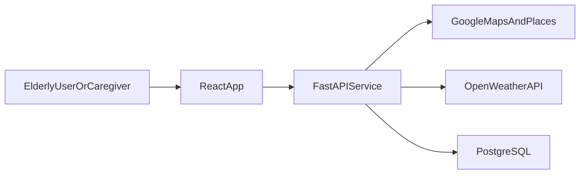

# ElderGo KL

Age-friendly travel and navigation platform for elderly users in Kuala Lumpur.

Frontend
Backend
Database
UI
Status

---

## 1) Overview

Many public transport apps are optimized for speed and complexity, not for clarity.  
For elderly users, this often means tiny text, too many route options, confusing transfer details, and interaction patterns that are easy to mis-tap.

ElderGo KL is built to reduce that friction. The product focuses on a simpler route decision flow, larger readable UI, multilingual support, and accessibility-oriented interaction design.

### Problem Context

- Existing transit apps can overload users with too many route choices
- Critical travel details are often visually dense
- Accessibility information is inconsistent or difficult to interpret
- Elderly users need confidence and clarity, not just shortest-time routing

### Target Users

- Elderly commuters in Klang Valley
- Elderly users with low-to-moderate digital confidence
- Family/caregivers supporting trip planning

---

## 2) Product Evolution

ElderGo KL was redesigned during development after we identified usability gaps in the original concept. Instead of only polishing visuals, the team refactored critical user flows to improve readability, action clarity, and step-by-step comprehension.

### Evolution Highlights

- **Input flow refinement:** from generic input to validated, suggestion-based location entry
- **Result readability:** from mixed route wording to cleaner step hierarchy and labels
- **Preference setup:** from hidden/secondary settings to onboarding-first preference capture
- **Actionability:** from static controls to working Save/Share actions on route result page
- **Localization depth:** from partial language switching to broader EN/BM route-related text coverage

---

## 3) Key Features

- **Large text accessibility mode** with global font scaling for improved readability
- **Simplified travel flow** from planning to route result with reduced decision load
- **Multilingual interface** with English and Bahasa Melayu support
- **Personalized travel preferences** (`accessibilityFirst`, `leastWalk`, `fewestTransfers`)
- **Elderly-friendly UI patterns** with clear action hierarchy and reduced ambiguity
- **Responsive design** tuned for mobile-first interaction behavior
- **Accessibility-aware route outputs** with annotation messaging and transparent fallbacks
- **Practical route actions** including local image save and share link flow

---

## 4) Accessibility-First Design

Accessibility is treated as a core product requirement, not a cosmetic layer.

### Design Principles

- **Readable first:** larger default typography and scalable font modes
- **Low cognitive load:** fewer competing actions and clearer primary pathways
- **Inclusive language support:** EN/BM switching in key travel flows
- **Step transparency:** route cards show action, duration, and annotation in a consistent structure
- **Honest confidence signals:** unknown/verified accessibility states are explicitly presented

### How It Appears in Product

- Top bar controls for language and font size
- Preference modal + settings page for route behavior tuning
- Step-by-step cards optimized for readability in mobile layouts
- Help pages written in practical, low-jargon guidance style

---

## 5) Tech Stack


| Layer         | Technology                      | Why We Use It                                                  |
| ------------- | ------------------------------- | -------------------------------------------------------------- |
| Frontend      | React, TypeScript, Tailwind CSS | Fast iteration, component-driven UI, safer typed logic         |
| Backend       | FastAPI, Python                 | Lightweight API implementation and service-oriented structure  |
| Data          | PostgreSQL                      | Persistent storage for user settings and route-related records |
| Design        | Figma                           | UX exploration and iteration before implementation             |
| Collaboration | GitHub                          | Branching, pull requests, code reviews, team workflow          |


---

## 6) System Architecture




- Frontend manages interaction flow, readability controls, and result presentation.
- Backend handles recommendation logic, preference-aware scoring, and data services.
- External APIs provide routing, location, and weather context.
- PostgreSQL persists app data when persistence mode is enabled.

---

## 7) Installation & Setup

### Prerequisites

- Node.js 18+
- npm
- Python 3.11+ (deployment runtime pinned separately in `runtime.txt`)

### Clone

```bash
git clone <your-repo-url>
cd ElderGo-KL
```

### Frontend Setup

```bash
cd frontend
npm install
npm run dev
```

### Backend Setup

```bash
cd backend
python3 -m venv .venv
source .venv/bin/activate
pip install -r requirements.txt
python -m uvicorn app.main:app --reload --app-dir . --host 127.0.0.1 --port 8000
```

### Optional Stable Local Dev Mode

From project root:

```bash
make frontend-dev
make backend-dev
```

### Environment Variables

Backend (`backend/.env`):


| Variable                      | Required       | Description                                   |
| ----------------------------- | -------------- | --------------------------------------------- |
| `ELDERGO_ENV`                 | Yes            | Environment mode (`development`/`production`) |
| `ELDERGO_DEMO_MODE`           | Yes            | Demo fallback behavior toggle                 |
| `ELDERGO_CORS_ORIGINS`        | Yes            | Frontend origin allowlist                     |
| `ELDERGO_DATABASE_URL`        | Yes (non-demo) | PostgreSQL connection string                  |
| `ELDERGO_GOOGLE_MAPS_API_KEY` | Yes            | Google Maps / Places backend access           |
| `OPENWEATHER_API_KEY`         | Optional       | Weather guidance integration                  |


Frontend:


| Variable                       | Required    | Description               |
| ------------------------------ | ----------- | ------------------------- |
| `VITE_API_BASE_URL`            | Yes         | Backend API base URL      |
| `VITE_GOOGLE_MAPS_API_KEY`     | Recommended | Browser map embedding key |
| `VITE_GOOGLE_MAPS_BROWSER_KEY` | Optional    | Fallback browser key      |


Security note:

- Do not commit real API keys or live credential values.

---

## 8) Project Structure

```text
.
├── backend
│   ├── app
│   │   ├── api
│   │   ├── core
│   │   ├── schemas
│   │   └── services
│   ├── requirements.txt
│   └── tests
├── frontend
│   ├── src
│   │   ├── app
│   │   ├── components
│   │   ├── i18n
│   │   ├── pages
│   │   ├── services
│   │   └── types
│   └── package.json
├── doc
├── render.yaml
├── runtime.txt
├── Makefile
└── README.md
```

---

## 9) Development Workflow

- GitHub branch-based collaboration with pull requests
- Pair programming for core feature implementation and bug-fixing loops
- UI/UX discussion anchored in Figma iterations
- Sprint-based task planning and refinement
- Code reviews focused on behavior stability, readability, and UX impact
- Manual smoke validation for language modes and mobile flows before merge

---

## 10) Future Improvements

- AI-assisted recommendation explanation layer
- Stronger route analysis transparency (why this route, not others)
- Deeper accessibility data coverage across more stations
- Better deep-link navigation and session recovery support
- Enhanced offline package export beyond static image output

---

## 11) License

This repository currently represents a university capstone/startup prototype.  
Add and reference your final license file (for example MIT) once release terms are confirmed.

---

## Additional Notes

### Deployment

- Render deployment configuration is provided in `render.yaml`.
- Python deployment runtime pin is in `runtime.txt`.
- Extended operational deployment notes are in `doc/ElderGo_KL_Render_Deployment_Manual.md`.

### Known Limitations

- Chatbot UI currently uses local/canned interaction behavior.
- App navigation is state-based (not full URL routing), so deep-linking is limited.
- Accessibility confidence still depends on available imported station datasets.

