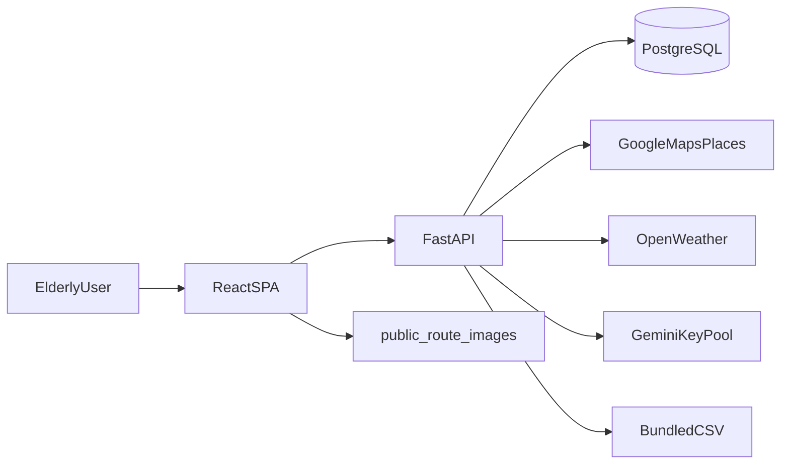

# ElderGo KL

Age-friendly transit planning for seniors in the Klang Valley — large-type UI, EN/BM support, accessibility-aware routes, station lookup, and an AI travel assistant.

---

## Overview

ElderGo KL reduces the friction of mainstream navigation apps: fewer competing options, clearer step-by-step instructions, validated place entry, and honest accessibility signals. The stack is a React SPA talking to a FastAPI backend, with PostgreSQL for stations/routes when enabled, Google Maps for directions and places, OpenWeather for destination weather, and **Google Gemini** for conversational help.

**Target users:** older commuters, caregivers planning trips, and anyone who prefers readable, low-cognitive-load transit guidance.

---

## Key features

- Large text modes (standard / large / extra large)
- Planning flow: origin + destination → departure time → recommended route
- Travel preferences: accessibility first, least walk, fewest transfers
- Station search and detail (DB + CSV fallbacks)
- Route result: step cards, map embed, weather, seat crowding hints, Google Maps handoff
- **AI chatbot:** route planning, POI questions, in-app guides, guardrails, Gemini key pool
- EN / Bahasa Melayu UI strings

---

## Tech stack

| Layer | Technology |
| ----- | ---------- |
| Frontend | React, TypeScript, Vite, Tailwind |
| Backend | FastAPI, Python 3.11+ |
| Database | PostgreSQL (+ PostGIS-style queries for accessibility points) |
| Routing / places | Google Directions & Places APIs |
| Weather | OpenWeather |
| AI | Google Gemini (`generateContent`, optional Maps grounding) |
| Deploy | Render (`render.yaml`) |

---

## System architecture



- **Frontend:** state-based navigation (no full URL router); calls `/api/v1/*`.
- **Backend:** route scoring, AI orchestration, location search, places proxy.
- **Bundled CSV/JSON:** shipped in the repo (see [Bundled data](#bundled-data-csvjson)); paths resolved via `backend/app/core/paths.py` so Render and local dev match.

---

## AI chatbot

### UI entry

- Component: [`frontend/src/components/AIChatbotSheet.tsx`](frontend/src/components/AIChatbotSheet.tsx) (lazy-loaded from [`frontend/src/app/App.tsx`](frontend/src/app/App.tsx))
- API: `POST /api/v1/ai/conversations` then `POST /api/v1/ai/conversations/{id}/messages`
- Request/response types: [`frontend/src/types/ai.ts`](frontend/src/types/ai.ts), [`backend/app/schemas/ai.py`](backend/app/schemas/ai.py)

### Message handling order

Implemented in [`backend/app/api/v1/endpoints/ai.py`](backend/app/api/v1/endpoints/ai.py) (`send_message`):

1. **Guardrail** — out-of-scope travel questions (rules / hybrid / prompt modes)
2. **Guide intents** — ticket guide, concession, privacy, preferences (DB-backed blocks + actions)
3. **Plan-route fast path** — messages with clear from/to (regex + known KV places) → [`ai_flow_service`](backend/app/services/ai_flow_service.py) without unnecessary Places round-trips
4. **Exploratory POI** — nearby cafes, en-route rest stops, senior-common places (hospital, mall, etc.)
5. **Structured chat flows** — `plan_route`, `weather`, station disambiguation, etc.
6. **DB intent resolver** — static help and deterministic answers
7. **Gemini fallback** — general travel Q&A; optional **Maps grounding** for place recommendations

Supporting modules:

| Module | Role |
| ------ | ---- |
| [`ai_intent_service.py`](backend/app/services/ai_intent_service.py) | Intent classification, planning prefill actions |
| [`ai_flow_service.py`](backend/app/services/ai_flow_service.py) | Multi-step flows (route, weather, place pick lists) |
| [`ai_route_parse_service.py`](backend/app/services/ai_route_parse_service.py) | Endpoint parsing, Gemini JSON assist |
| [`ai_exploratory_poi_service.py`](backend/app/services/ai_exploratory_poi_service.py) | POI / en-route / senior-place routing |
| [`ai_guardrail_service.py`](backend/app/services/ai_guardrail_service.py) | Travel-scope filter |
| [`chat_blocks_service.py`](backend/app/services/chat_blocks_service.py) | Rich blocks (text, place cards, errors) |
| [`gemini_client.py`](backend/app/services/gemini_client.py) | Key pool + API calls |

### Response sources

The API sets `response_source` on each reply:

| Value | Meaning |
| ----- | ------- |
| `db` | Static or database-backed content |
| `flow` | Structured flow engine (forms, place lists, route compute) |
| `gemini` | Gemini text generation |
| `gemini_maps` | Gemini with Maps grounding (place cards) |

The UI can hide this field; it remains useful for debugging.

### Gemini key pool

Configured via environment (see [`backend/.env.example`](backend/.env.example)):

- `ELDERGO_GEMINI_API_KEY_PRIMARY`
- `ELDERGO_GEMINI_API_KEY_SECONDARY`
- `ELDERGO_GEMINI_API_KEYS` — comma-separated extras

[`GeminiKeyPool`](backend/app/services/gemini_client.py) deduplicates keys, rotates on each request, and marks a key **exhausted until end of day (MYT)** after HTTP **429**. [`call_with_key_pool()`](backend/app/services/gemini_client.py) tries keys in order; returns `quota_exhausted` or `unavailable` when all fail.

On startup the API logs a warning if no keys are set (chatbot still works for DB/flow paths).

**Note:** Pool calls use synchronous `httpx` — acceptable at current scale; consider async if traffic grows.

### Local AI tests

```bash
cd backend
source .venv/bin/activate
pytest tests/test_ai_chatbox_regression.py tests/test_ai_exploratory_poi.py -q
```

---

## Bundled data (CSV/JSON)

Paths are defined in [`backend/app/core/paths.py`](backend/app/core/paths.py) (stable on Render; not tied to process cwd).

| Asset | Path | Runtime use |
| ----- | ---- | ------------- |
| MRT station facilities | `backend/data/mrt_stations_facilities.csv` | Merged into station detail via [`mrt_facilities_service.py`](backend/app/services/mrt_facilities_service.py) |
| Route step images | `backend/data/route_station_images.csv` | Step photos; files under [`frontend/public/route-images/`](frontend/public/route-images/) |
| GTFS / accessibility fallback | `backend/csv_output/` | [`csv_locations_service.py`](backend/app/services/csv_locations_service.py) when Postgres unavailable |
| Seat probability (build input) | `backend/data/rapidkl_ridership_*.csv` | Build-time only |
| Seat probability (runtime) | `frontend/src/data/seatByDateAndCode.json` | Bundled in static build |

Regenerate seat JSON after updating ridership CSV:

```bash
cd frontend
npm run generate:seat-probability
```

**Health check:** `GET /api/v1/health/data` reports CSV presence and `gemini_keys_configured` count (no secret values).

---

## Installation

### Prerequisites

- Node.js 18+
- Python 3.11+ (see [`runtime.txt`](runtime.txt))
- PostgreSQL (optional if `ELDERGO_DEMO_MODE=true`)

### Backend

```bash
cd backend
cp .env.example .env   # fill in keys
python3 -m venv .venv
source .venv/bin/activate
pip install -r requirements.txt
python -m uvicorn app.main:app --reload --host 127.0.0.1 --port 8000
```

### Frontend

```bash
cd frontend
npm install
# optional: echo "VITE_API_BASE_URL=http://127.0.0.1:8000" > .env.local
npm run dev
```

### Database import (optional)

See [`backend/database/README.md`](backend/database/README.md). With a populated DB, set `ELDERGO_DEMO_MODE=false` for route persistence.

---

## Environment variables

Copy [`backend/.env.example`](backend/.env.example) to `backend/.env`.

| Variable | Description |
| -------- | ----------- |
| `ELDERGO_ENV` | `development` or `production` |
| `ELDERGO_DEMO_MODE` | `true` skips route DB persist; use `false` with Postgres in production |
| `ELDERGO_CORS_ORIGINS` | Comma-separated frontend origins |
| `ELDERGO_DATABASE_URL` | PostgreSQL URL |
| `ELDERGO_GOOGLE_MAPS_API_KEY` | Server-side Maps / Places |
| `OPENWEATHER_API_KEY` | Weather (optional) |
| `ELDERGO_GEMINI_MODEL` | e.g. `gemini-2.0-flash` |
| `ELDERGO_GEMINI_API_KEY_*` | Gemini pool (at least one key for AI answers) |
| `ELDERGO_AI_GUARDRAIL_*` | Enable/mode/strict guardrails |

Frontend (`.env.local` or Render static env):

| Variable | Description |
| -------- | ----------- |
| `VITE_API_BASE_URL` | Backend base URL |
| `VITE_GOOGLE_MAPS_API_KEY` | Map embed / browser |
| `VITE_GOOGLE_MAPS_BROWSER_KEY` | Optional embed fallback |

Do **not** commit real secrets. Legacy `ELDERGO_GEMINI_MAPS_GROUNDING_*` vars in some local `.env` files are **unused** by the current code (grounding lat/lon are fixed in `gemini_client.py`).

---

## Render deployment

Canonical config: [`render.yaml`](render.yaml).

1. Connect the GitHub repo as a **Blueprint** (or create two services manually from the yaml).
2. Create a **PostgreSQL** instance; set `ELDERGO_DATABASE_URL` on the API service.
3. Set secrets in the Render dashboard: Google Maps, OpenWeather, Gemini keys, frontend `VITE_*` keys.
4. Set `ELDERGO_DEMO_MODE=false` when the DB is imported and you want routes saved.
5. Ensure `ELDERGO_CORS_ORIGINS` matches the static site URL.

After deploy:

```bash
curl https://eldergo-kl-api.onrender.com/api/v1/health/data
```

Smoke-test: planning, stations, route result, chatbot (route + POI question).

---

## Project structure

```text
.
├── backend/
│   ├── app/
│   │   ├── api/v1/endpoints/   # ai, routes, locations, places, weather
│   │   ├── core/               # config, paths
│   │   ├── services/           # route, AI, CSV loaders, gemini_client
│   │   └── schemas/
│   ├── data/                   # mrt_facilities, route_station_images, ridership CSV
│   ├── csv_output/             # GTFS/accessibility fallback CSV
│   ├── database/               # schema, import scripts
│   ├── tests/
│   └── .env.example
├── frontend/
│   ├── public/route-images/    # step photos referenced by CSV
│   ├── src/data/               # seat probability JSON
│   └── src/
├── render.yaml
├── runtime.txt
└── README.md
```

The `doc/` folder holds local design reports and is **gitignored** (not pushed to remote).

---

## Development workflow

- Feature branches and pull requests on GitHub
- Backend: `pytest` under `backend/tests/`
- Frontend: `npm run build` before release
- Manual smoke: EN/BM, large font, planning, chatbot, Start Navigation

---

## Known limitations

- App navigation is in-memory state (limited deep linking)
- Accessibility coverage depends on imported station/accessibility data
- Gemini quota is shared across keys; 429 triggers daily key cooldown
- Free-tier Render cold starts add latency

---

## Future improvements

- Stronger “why this route” explanations in the UI
- Broader station accessibility coverage
- URL-based routing / shareable in-app deep links
- Async Gemini client for higher chat concurrency

---

## License

University capstone / startup prototype. Add a formal license (e.g. MIT) before public release.
