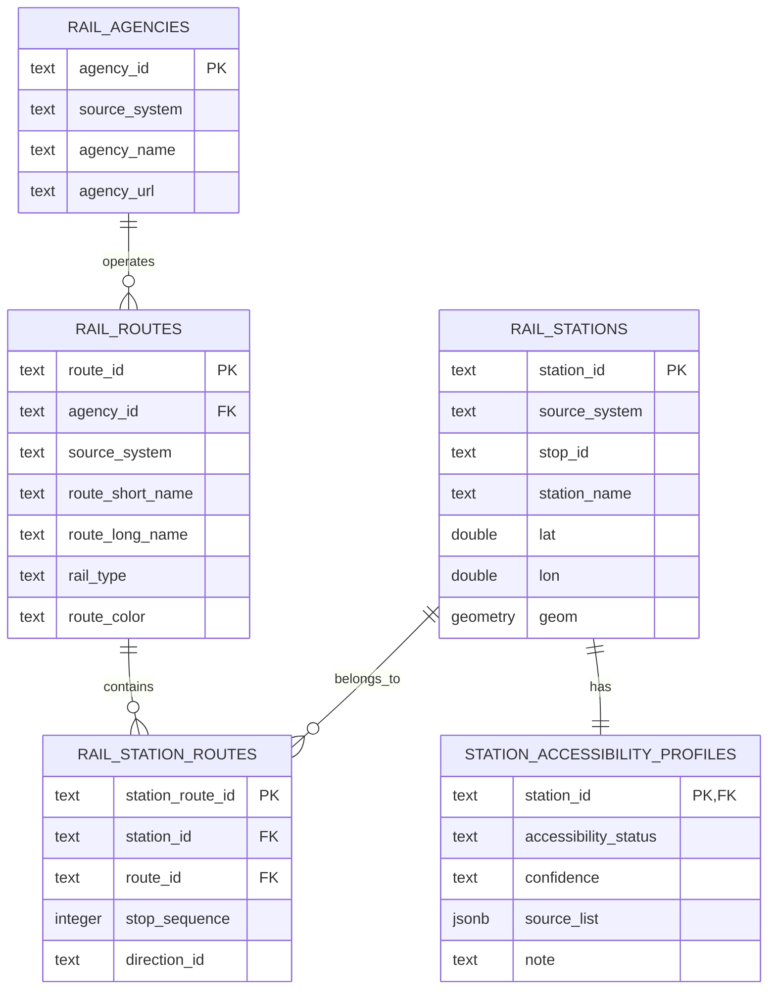
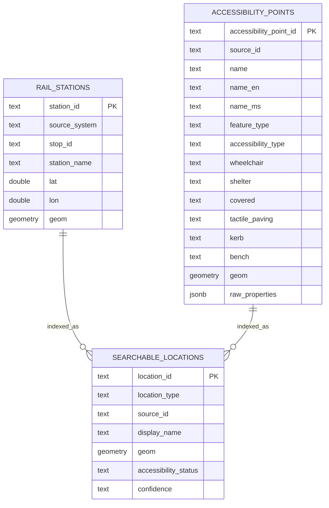
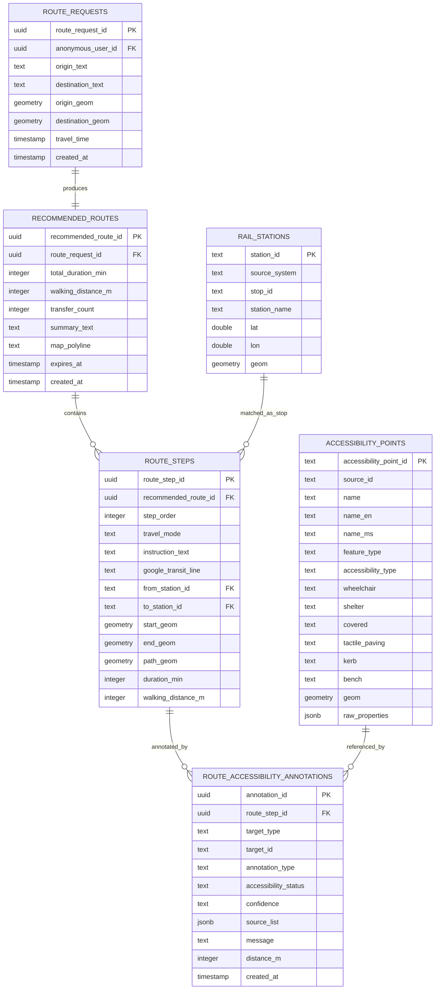
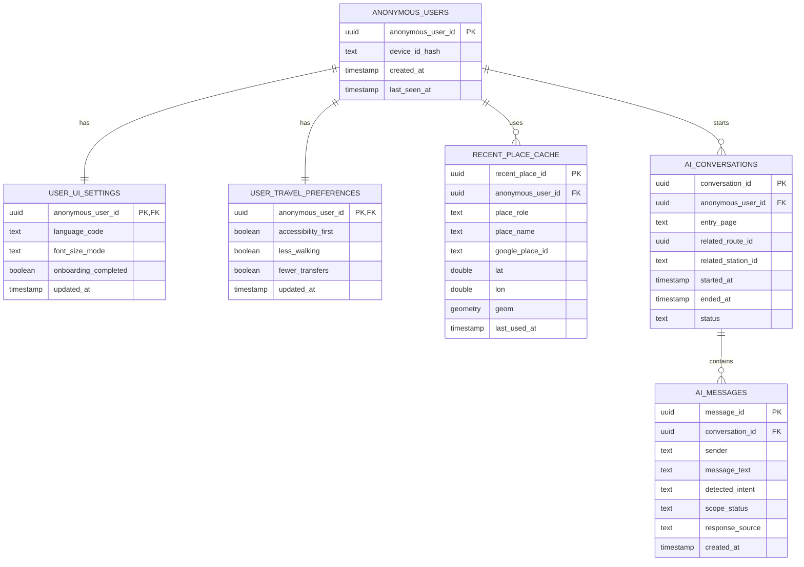
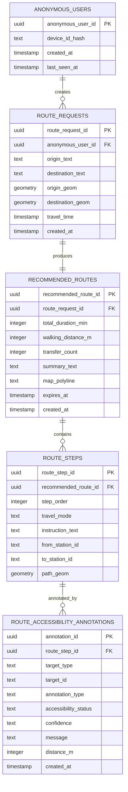

# ElderGo KL 当前阶段 Data Plan

## 1. 计划范围

本 Data Plan 描述 ElderGo KL 当前阶段的数据设计，覆盖：

- 业务流程
- 数据对象
- 数据关系
- 数据来源
- PostgreSQL/PostGIS 数据库原型
- Python ETL 数据录入流程
- FastAPI 后端、前端与数据库的交互方式

当前阶段采用的核心策略：

- 路线生成依赖 Google Maps API。
- 本地数据库不保存所有 Google 候选路线，只保存最终推荐路线和路线无障碍注释。
- Bus 暂不使用 GTFS 静态数据，Bus 路线由 Google Maps 提供。
- Rail 使用 KTMB 与 Rapid Rail 的 GTFS 静态 CSV。
- 无障碍数据只保留 Point，不使用 LineString。
- 无障碍信息不是实时状态，只表示静态数据中记录的支持信息。
- 缺失无障碍数据不等于不支持，必须标记为 `unknown`。

---

## 2. 业务流程

### 2.1 静态数据准备流程

```text
KTMB GTFS CSV
+ Rapid Rail GTFS CSV
+ 清洗后的无障碍 Point CSV
        ↓
Python ETL 清洗与标准化
        ↓
PostgreSQL/PostGIS
        ↓
生成 rail station、rail route、accessibility point、station accessibility profile、search index
```

### 2.2 路线推荐与 Epic 5 无障碍注释流程

```text
用户输入起点、终点、出行时间
        ↓
前端调用 FastAPI
        ↓
FastAPI 保存 route_request
        ↓
FastAPI 调用 Google Maps API
        ↓
Google 返回候选路线
        ↓
FastAPI 根据用户偏好选择最终推荐路线
        ↓
保存 recommended_route 和 route_steps
        ↓
针对每个 route_step 生成 accessibility annotations
        ↓
前端展示路线摘要、步骤、无障碍提示
```

Epic 5 的无障碍注释分两类。

Transit step：

```text
Google transit step
        ↓
先检查 Google 是否明确返回 wheelchair/accessibility support
        ↓
如果有：标记 supported，source=google_accessibility_hint
        ↓
如果没有：用站名 + 坐标匹配本地 rail_stations
        ↓
读取 station_accessibility_profiles
        ↓
如果本地有支持信息：标记 supported
        ↓
如果本地也没有：标记 unknown
```

Walking step：

```text
Google walking polyline
        ↓
PostGIS 查询 30m/50m 内 accessibility_points
        ↓
shelter=yes 或 covered=yes
        → nearby_sheltered_point
        ↓
wheelchair=yes / lift / accessible_entrance / kerb_ramp
        → nearby_accessibility_support
        ↓
没有匹配
        → unknown / no nearby static accessibility data
```

### 2.3 Epic 6 站点与设施搜索流程

```text
rail_stations
+ accessibility_points
        ↓
searchable_locations
        ↓
前端搜索 station / accessibility point
        ↓
FastAPI 查询 searchable_locations
        ↓
返回搜索结果与基础 accessibility status
```

`searchable_locations` 是搜索索引表，不是业务事实的唯一来源。未来加入站内图层、站内设施、rush hour 预测时，应新增独立业务表，再将搜索摘要同步到 `searchable_locations`。

### 2.4 用户缓存流程

```text
用户首次打开系统
        ↓
前端生成 device_id
        ↓
FastAPI hash device_id
        ↓
创建或读取 anonymous_users
        ↓
读取 user_ui_settings 和 user_travel_preferences
        ↓
前端恢复语言、字体、偏好、onboarding 状态
```

---

## 3. 数据对象

当前阶段数据对象分为两大类：

1. 业务数据对象
2. 用户缓存数据对象

### 3.1 业务数据对象

| 数据对象 | 表名 | 作用 |
|---|---|---|
| Rail 运营商 | `rail_agencies` | 保存 KTMB、Rapid KL 等运营商与数据来源 |
| Rail 线路 | `rail_routes` | 保存 KTM/LRT/MRT/Monorail 等线路信息 |
| Rail 车站 | `rail_stations` | 保存 rail station 名称、坐标、来源 |
| 车站-线路关系 | `rail_station_routes` | 保存站点属于哪些线路，以及站序 |
| 无障碍点 | `accessibility_points` | 保存 Point 类型无障碍设施 |
| 车站无障碍汇总 | `station_accessibility_profiles` | 汇总每个车站的无障碍状态与置信度 |
| 路线请求 | `route_requests` | 保存用户一次起终点路线请求 |
| 最终推荐路线 | `recommended_routes` | 保存 Google 候选路线中最终选出的路线 |
| 路线步骤 | `route_steps` | 保存最终推荐路线的分步信息 |
| 路线无障碍注释 | `route_accessibility_annotations` | 保存 Epic 5 展示用的无障碍提示 |
| 搜索索引 | `searchable_locations` | 支撑 Epic 6 搜索 rail station 和 accessibility point |

### 3.2 用户缓存数据对象

| 数据对象 | 表名 | 作用 |
|---|---|---|
| 匿名用户 | `anonymous_users` | 不登录情况下识别同一设备用户 |
| UI 设置 | `user_ui_settings` | 缓存语言、字体、onboarding 状态 |
| 出行偏好 | `user_travel_preferences` | 缓存无障碍优先、少步行、少换乘 |
| 最近地点 | `recent_place_cache` | 缓存最近起点、终点 |
| AI 会话 | `ai_conversations` | 为未来 Epic 8 记录一次 AI 会话 |
| AI 消息 | `ai_messages` | 为未来 Epic 8 记录用户与 AI 的消息 |

---

## 4. 数据关系

### 4.1 静态业务数据关系



### 4.2 无障碍点与 Epic 6 搜索索引关系



### 4.3 路线结果与 Epic 5 注释关系



### 4.4 用户缓存关系



### 4.5 anonymous_users 与业务运行结果关系

静态业务表不直接关联用户。运行时路线结果表通过 `route_requests` 关联匿名用户。



---

## 5. 数据来源

### 5.1 GTFS 数据来源

| 来源 | 文件 | 使用程度 | 使用字段 |
|---|---|---|---|
| KTMB GTFS | `agency.csv` | 必须 | `agency_id`, `agency_name`, `agency_url`, `agency_timezone` |
| KTMB GTFS | `routes.csv` | 必须 | `route_id`, `agency_id`, `route_short_name`, `route_long_name`, `route_type`, `route_color` |
| KTMB GTFS | `stops.csv` | 必须 | `stop_id`, `stop_name`, `stop_lat`, `stop_lon` |
| KTMB GTFS | `trips.csv` | 保留 | `trip_id`, `route_id`, `service_id`, `direction_id` |
| KTMB GTFS | `stop_times.csv` | 保留 | `trip_id`, `stop_id`, `stop_sequence`, `arrival_time`, `departure_time` |
| Rapid Rail GTFS | `agency.csv` | 必须 | `agency_id`, `agency_name`, `agency_url`, `agency_timezone` |
| Rapid Rail GTFS | `routes.csv` | 必须 | `route_id`, `agency_id`, `route_short_name`, `route_long_name`, `route_type`, `route_color`, `category`, `status` |
| Rapid Rail GTFS | `stops.csv` | 必须 | `stop_id`, `stop_name`, `stop_lat`, `stop_lon`, `category`, `route_id`, `isOKU`, `status`, `search` |
| Rapid Rail GTFS | `trips.csv` | 保留 | `trip_id`, `route_id`, `service_id`, `trip_headsign`, `direction_id` |
| Rapid Rail GTFS | `stop_times.csv` | 保留 | `trip_id`, `stop_id`, `stop_sequence`, `arrival_time`, `departure_time` |

当前阶段不依赖：

- `calendar.csv`
- `shapes.csv`
- `frequencies.csv`

这些数据可作为 future enhancement，不作为 MVP 业务逻辑依赖。

### 5.2 无障碍数据来源

| 来源文件 | 使用字段 | 说明 |
|---|---|---|
| `accessibility_feature_clean.csv` | `source_id` | 原始无障碍点来源 ID |
| `accessibility_feature_clean.csv` | `name_en`, `name_ms`, `name_default` | 名称字段，可能为空 |
| `accessibility_feature_clean.csv` | `feature_type` | 点是什么，例如 bus_stop、elevator、station_entrance |
| `accessibility_feature_clean.csv` | `accessibility_type` | 点的无障碍意义，例如 wheelchair_stop、lift、kerb_ramp |
| `accessibility_feature_clean.csv` | `wheelchair` | 是否有轮椅相关支持 |
| `accessibility_feature_clean.csv` | `shelter` | 是否有 shelter |
| `accessibility_feature_clean.csv` | `covered` | 是否有 covered support |
| `accessibility_feature_clean.csv` | `tactile_paving` | 是否有 tactile paving |
| `accessibility_feature_clean.csv` | `kerb` | kerb 类型 |
| `accessibility_feature_clean.csv` | `bench` | 是否有 bench |
| `accessibility_feature_clean.csv` | `geom_type` | 当前只保留 Point |
| `accessibility_feature_clean.csv` | `geom_wkt` | 转为 PostGIS geometry |
| `accessibility_feature_clean.csv` | `raw_properties` | 原始属性追溯 |

`accessibility_transit_points_clean.csv` 可用于交通相关点位验证，但当前简化模型中可统一导入到 `accessibility_points`，用 `feature_type` 和 `accessibility_type` 区分用途。

### 5.3 Google Maps API 数据来源

Google Maps API 在系统运行时提供：

- 起点、终点地点信息
- 路线候选结果
- 推荐路线步骤
- transit step 的 departure stop / arrival stop
- walking step 的 polyline
- 可能存在的 accessibility hint

本地数据库只保存最终选出的推荐路线，不保存全部候选路线。

---

## 6. 数据库原型与字段解释

### 6.1 `rail_agencies`

保存 rail 数据来源与运营商。

| 字段 | 类型 | 说明 |
|---|---|---|
| `agency_id` | text PK | 运营商主键，建议加来源前缀 |
| `source_system` | text | `ktmb` 或 `rapid_rail` |
| `agency_name` | text | 运营商名称 |
| `agency_url` | text | 运营商网站 |
| `agency_timezone` | text | 时区 |

### 6.2 `rail_routes`

保存 rail 线路。

| 字段 | 类型 | 说明 |
|---|---|---|
| `route_id` | text PK | 线路主键，建议加来源前缀 |
| `agency_id` | text FK | 关联 `rail_agencies` |
| `source_system` | text | 数据来源 |
| `route_short_name` | text | 线路短名 |
| `route_long_name` | text | 线路长名 |
| `rail_type` | text | `KTM`, `LRT`, `MRT`, `Monorail`, `unknown` |
| `route_color` | text | 线路颜色 |

### 6.3 `rail_stations`

保存 rail 站点。

| 字段 | 类型 | 说明 |
|---|---|---|
| `station_id` | text PK | 站点主键，建议加来源前缀 |
| `source_system` | text | `ktmb` 或 `rapid_rail` |
| `stop_id` | text | 原始 GTFS stop_id |
| `station_name` | text | 站点名称 |
| `lat` | double precision | 纬度 |
| `lon` | double precision | 经度 |
| `geom` | geometry(Point, 4326) | PostGIS 空间点 |

坐标转换规则：

```sql
ST_SetSRID(ST_MakePoint(lon, lat), 4326)
```

### 6.4 `rail_station_routes`

保存站点与线路关系。

| 字段 | 类型 | 说明 |
|---|---|---|
| `station_route_id` | text PK | 关系主键 |
| `station_id` | text FK | 关联 `rail_stations` |
| `route_id` | text FK | 关联 `rail_routes` |
| `stop_sequence` | integer | 站点在线路中的顺序 |
| `direction_id` | text | 方向 |

该表由 `trips.csv` + `stop_times.csv` 推导生成。

### 6.5 `accessibility_points`

保存 Point 类型无障碍设施。

| 字段 | 类型 | 说明 |
|---|---|---|
| `accessibility_point_id` | text PK | 无障碍点主键 |
| `source_id` | text | 原始来源 ID |
| `name` | text | 展示名，优先使用名称字段，否则使用类型 fallback |
| `name_en` | text | 英文名 |
| `name_ms` | text | 马来文名 |
| `feature_type` | text | 点是什么 |
| `accessibility_type` | text | 点的无障碍意义 |
| `wheelchair` | text | `yes`, `no`, `limited`, 空值 |
| `shelter` | text | `yes`, `no`, 空值 |
| `covered` | text | `yes`, `no`, 空值 |
| `tactile_paving` | text | 触觉铺装信息 |
| `kerb` | text | kerb 类型 |
| `bench` | text | 是否有座椅 |
| `geom` | geometry(Point, 4326) | 空间点 |
| `raw_properties` | jsonb | 原始属性 |

`feature_type` 示例：

- `bus_stop`
- `station`
- `platform`
- `elevator`
- `station_entrance`
- `kerb_ramp`
- `accessible_entrance`

`accessibility_type` 示例：

- `wheelchair_stop`
- `lift`
- `accessible_station_entrance`
- `kerb_ramp`
- `wheelchair_access`
- `tactile_path`

### 6.6 `station_accessibility_profiles`

保存每个 station 的无障碍汇总状态。

| 字段 | 类型 | 说明 |
|---|---|---|
| `station_id` | text PK/FK | 关联 `rail_stations` |
| `accessibility_status` | text | `supported`, `unknown`, `not_supported` |
| `confidence` | text | `high`, `medium`, `low` |
| `source_list` | jsonb | 结论来源 |
| `note` | text | 说明 |

当前阶段生成规则：

```text
Rapid Rail isOKU=true
→ supported / high / ["rapid_rail_isOKU"]

50m 内有 wheelchair=yes accessibility point
→ supported / medium / ["accessibility_point_50m"]

没有明确数据
→ unknown / low / []
```

`not_supported` 字段保留，但当前阶段不会主动生成，除非未来有可靠官方数据明确说明不支持。

### 6.7 `route_requests`

保存用户一次路线请求。

| 字段 | 类型 | 说明 |
|---|---|---|
| `route_request_id` | uuid PK | 路线请求主键 |
| `anonymous_user_id` | uuid FK | 关联匿名用户，可为空 |
| `origin_text` | text | 起点文本 |
| `destination_text` | text | 终点文本 |
| `origin_geom` | geometry(Point, 4326) | 起点坐标 |
| `destination_geom` | geometry(Point, 4326) | 终点坐标 |
| `travel_time` | timestamp | 用户选择的出行时间 |
| `created_at` | timestamp | 创建时间 |

### 6.8 `recommended_routes`

保存最终推荐路线。

| 字段 | 类型 | 说明 |
|---|---|---|
| `recommended_route_id` | uuid PK | 推荐路线主键 |
| `route_request_id` | uuid FK | 关联 `route_requests` |
| `total_duration_min` | integer | 总耗时 |
| `walking_distance_m` | integer | 总步行距离 |
| `transfer_count` | integer | 换乘次数 |
| `summary_text` | text | 路线摘要 |
| `map_polyline` | text | Google polyline |
| `expires_at` | timestamp | 缓存过期时间 |
| `created_at` | timestamp | 创建时间 |

### 6.9 `route_steps`

保存推荐路线的步骤。

| 字段 | 类型 | 说明 |
|---|---|---|
| `route_step_id` | uuid PK | 路线步骤主键 |
| `recommended_route_id` | uuid FK | 关联推荐路线 |
| `step_order` | integer | 步骤顺序 |
| `travel_mode` | text | `WALKING`, `TRANSIT` 等 |
| `instruction_text` | text | 步骤说明 |
| `google_transit_line` | text | Google 返回的线路名 |
| `from_station_id` | text FK | 匹配到的本地起点车站 |
| `to_station_id` | text FK | 匹配到的本地终点车站 |
| `start_geom` | geometry(Point, 4326) | 步骤起点 |
| `end_geom` | geometry(Point, 4326) | 步骤终点 |
| `path_geom` | geometry(LineString, 4326) | 步行或路线片段 geometry |
| `duration_min` | integer | 步骤耗时 |
| `walking_distance_m` | integer | 步行距离 |

### 6.10 `route_accessibility_annotations`

保存 Epic 5 展示用的路线无障碍注释。

| 字段 | 类型 | 说明 |
|---|---|---|
| `annotation_id` | uuid PK | 注释主键 |
| `route_step_id` | uuid FK | 关联路线步骤 |
| `target_type` | text | `station`, `accessibility_point`, `google_hint` |
| `target_id` | text | 目标对象 ID |
| `annotation_type` | text | 注释类型 |
| `accessibility_status` | text | `supported`, `unknown`, `not_supported` |
| `confidence` | text | `high`, `medium`, `low` |
| `source_list` | jsonb | 数据来源 |
| `message` | text | 前端展示文案 |
| `distance_m` | integer | 距离，适用于 nearby point |
| `created_at` | timestamp | 创建时间 |

`annotation_type` 示例：

- `station_wheelchair_accessibility`
- `nearby_sheltered_point`
- `nearby_accessibility_support`
- `accessibility_unknown`

### 6.11 `searchable_locations`

保存 Epic 6 搜索入口。

| 字段 | 类型 | 说明 |
|---|---|---|
| `location_id` | text PK | 搜索对象 ID |
| `location_type` | text | `rail_station`, `bus_stop`, `elevator`, `kerb_ramp` 等 |
| `source_id` | text | 原始来源 ID |
| `display_name` | text | 搜索结果展示名 |
| `geom` | geometry(Geometry, 4326) | 空间位置 |
| `accessibility_status` | text | 搜索摘要中的无障碍状态 |
| `confidence` | text | 搜索摘要置信度 |

### 6.12 用户缓存表字段

#### `anonymous_users`

| 字段 | 类型 | 说明 |
|---|---|---|
| `anonymous_user_id` | uuid PK | 匿名用户 ID |
| `device_id_hash` | text | 设备 ID 哈希 |
| `created_at` | timestamp | 首次创建时间 |
| `last_seen_at` | timestamp | 最近使用时间 |

#### `user_ui_settings`

| 字段 | 类型 | 说明 |
|---|---|---|
| `anonymous_user_id` | uuid PK/FK | 匿名用户 ID |
| `language_code` | text | `en` 或 `ms` |
| `font_size_mode` | text | `standard`, `large`, `extra_large` |
| `onboarding_completed` | boolean | 是否完成首次引导 |
| `updated_at` | timestamp | 更新时间 |

#### `user_travel_preferences`

| 字段 | 类型 | 说明 |
|---|---|---|
| `anonymous_user_id` | uuid PK/FK | 匿名用户 ID |
| `accessibility_first` | boolean | 是否无障碍优先 |
| `less_walking` | boolean | 是否偏好少步行 |
| `fewer_transfers` | boolean | 是否偏好少换乘 |
| `updated_at` | timestamp | 更新时间 |

#### `recent_place_cache`

| 字段 | 类型 | 说明 |
|---|---|---|
| `recent_place_id` | uuid PK | 最近地点 ID |
| `anonymous_user_id` | uuid FK | 匿名用户 ID |
| `place_role` | text | `origin` 或 `destination` |
| `place_name` | text | 地点名称 |
| `google_place_id` | text | Google Place ID |
| `lat` | double precision | 纬度 |
| `lon` | double precision | 经度 |
| `geom` | geometry(Point, 4326) | 空间点 |
| `last_used_at` | timestamp | 最近使用时间 |

#### `ai_conversations`

| 字段 | 类型 | 说明 |
|---|---|---|
| `conversation_id` | uuid PK | AI 会话 ID |
| `anonymous_user_id` | uuid FK | 匿名用户 ID |
| `entry_page` | text | 用户从哪个页面打开 AI |
| `related_route_id` | uuid | 可选关联推荐路线 |
| `related_station_id` | text | 可选关联站点 |
| `started_at` | timestamp | 会话开始时间 |
| `ended_at` | timestamp | 会话结束时间 |
| `status` | text | `active`, `closed`, `failed` |

#### `ai_messages`

| 字段 | 类型 | 说明 |
|---|---|---|
| `message_id` | uuid PK | 消息 ID |
| `conversation_id` | uuid FK | 关联 AI 会话 |
| `sender` | text | `user`, `assistant`, `system` |
| `message_text` | text | 消息内容 |
| `detected_intent` | text | 识别到的意图 |
| `scope_status` | text | `supported`, `out_of_scope`, `unclear`, `missing_data` |
| `response_source` | text | `database`, `google`, `static_help`, `mixed`, `fallback` |
| `created_at` | timestamp | 创建时间 |

---

## 7. PostgreSQL 数据录入计划

### 7.1 数据库初始化

PostgreSQL 需要启用：

```sql
CREATE EXTENSION IF NOT EXISTS postgis;
CREATE EXTENSION IF NOT EXISTS pg_trgm;
CREATE EXTENSION IF NOT EXISTS "uuid-ossp";
```

### 7.2 Python ETL 步骤

Python ETL 负责从 CSV 录入 PostgreSQL。

```text
Step 1: 读取 KTMB / Rapid Rail agency.csv
        → rail_agencies

Step 2: 读取 routes.csv
        → rail_routes

Step 3: 读取 stops.csv
        → rail_stations

Step 4: 读取 trips.csv + stop_times.csv
        → rail_station_routes

Step 5: 读取 accessibility_feature_clean.csv
        → accessibility_points

Step 6: 使用 PostGIS 进行 station 与 accessibility point 的 50m 空间匹配
        → station_accessibility_profiles

Step 7: 将 rail_stations 和 accessibility_points 同步到 searchable_locations
```

### 7.3 ETL 关键转换规则

ID 前缀：

```text
ktmb:50500
rapid_rail:KJ15
osm:node/1707840846
```

坐标转换：

```sql
ST_SetSRID(ST_MakePoint(lon, lat), 4326)
```

无障碍 Point 限制：

```text
只导入 geom_type = Point
跳过 LineString
```

无障碍名称 fallback：

```text
name_en
→ name_ms
→ name_default
→ accessibility_type display label
→ source_id
```

KTMB 数据质量处理：

```text
如果 stop_times 引用不存在的 stop_id，跳过该异常行
不伪造不存在的 station
```

### 7.4 推荐索引

空间索引：

```sql
CREATE INDEX ON rail_stations USING GIST (geom);
CREATE INDEX ON accessibility_points USING GIST (geom);
CREATE INDEX ON route_steps USING GIST (path_geom);
CREATE INDEX ON searchable_locations USING GIST (geom);
```

搜索索引：

```sql
CREATE INDEX ON rail_stations USING GIN (station_name gin_trgm_ops);
CREATE INDEX ON searchable_locations USING GIN (display_name gin_trgm_ops);
```

---

## 8. 前后端与数据库交互

### 8.1 系统结构

```text
Frontend
        ↓ REST API
FastAPI Backend
        ↓ SQL / ORM
PostgreSQL + PostGIS
        ↓
Static rail data + accessibility data + route result data
```

前端不直接连接 PostgreSQL。所有数据库访问都通过 FastAPI。

### 8.2 首次进入与用户缓存

前端：

```text
读取或生成 local device_id
调用 POST /users/resolve
```

FastAPI：

```text
hash device_id
查询 anonymous_users
如果不存在则创建 anonymous_users
创建默认 user_ui_settings
创建默认 user_travel_preferences
返回用户设置
```

数据库涉及表：

- `anonymous_users`
- `user_ui_settings`
- `user_travel_preferences`

### 8.3 用户更新语言、字体、偏好

前端：

```text
PUT /users/{anonymous_user_id}/ui-settings
PUT /users/{anonymous_user_id}/travel-preferences
```

FastAPI：

```text
校验 language_code / font_size_mode
更新 user_ui_settings
更新 user_travel_preferences
```

数据库涉及表：

- `user_ui_settings`
- `user_travel_preferences`

### 8.4 站点与设施搜索 Epic 6

前端：

```text
GET /locations/search?q=KL Sentral
GET /locations/{location_id}
```

FastAPI：

```text
查询 searchable_locations
如果 location_type = rail_station
    查询 rail_stations 和 station_accessibility_profiles
如果 location_type = accessibility point
    查询 accessibility_points
返回统一搜索结果
```

数据库涉及表：

- `searchable_locations`
- `rail_stations`
- `station_accessibility_profiles`
- `accessibility_points`

### 8.5 路线规划与 Epic 5

前端：

```text
POST /routes/recommend
```

请求内容：

```json
{
  "anonymous_user_id": "...",
  "origin_text": "Taman Bahagia",
  "destination_text": "KL Sentral",
  "origin_lat": 3.1100,
  "origin_lon": 101.6000,
  "destination_lat": 3.1340,
  "destination_lon": 101.6869,
  "travel_time": "2026-04-26T09:00:00"
}
```

FastAPI：

```text
1. 读取 user_travel_preferences
2. 写入 route_requests
3. 调用 Google Maps API
4. 根据偏好选择最终推荐路线
5. 写入 recommended_routes
6. 解析 Google steps，写入 route_steps
7. 对 transit step 生成 station annotation
8. 对 walking step 生成 nearby accessibility point annotation
9. 返回 recommended_route + route_steps + annotations
```

数据库涉及表：

- `user_travel_preferences`
- `route_requests`
- `recommended_routes`
- `route_steps`
- `route_accessibility_annotations`
- `rail_stations`
- `station_accessibility_profiles`
- `accessibility_points`

### 8.6 Epic 5 Transit Step 注释逻辑

FastAPI 对每个 transit step 执行：

```text
1. 检查 Google 是否明确返回 accessibility support
2. 如果有：
   - annotation status = supported
   - confidence = medium
   - source_list = ["google_accessibility_hint"]
3. 如果 Google 没有：
   - 用 Google station name + coordinate 匹配 rail_stations
   - 读取 station_accessibility_profiles
4. 如果本地 profile supported：
   - annotation status = supported
   - confidence = profile.confidence
5. 如果本地也没有：
   - annotation status = unknown
   - confidence = low
```

### 8.7 Epic 5 Walking Step 注释逻辑

FastAPI 对每个 walking step 执行：

```text
1. 将 Google walking polyline 转成 PostGIS LineString
2. 查询 30m/50m 内 accessibility_points
3. 如果 shelter=yes 或 covered=yes：
   - annotation_type = nearby_sheltered_point
4. 如果 wheelchair=yes 或 accessibility_type in lift / accessible_entrance / kerb_ramp：
   - annotation_type = nearby_accessibility_support
5. 如果没有匹配：
   - 可生成 unknown annotation，或前端不显示该类提示
```

查询示例：

```sql
SELECT *
FROM accessibility_points
WHERE ST_DWithin(
    geom::geography,
    :walking_path_geom::geography,
    50
);
```

### 8.8 AI Assistant Epic 8 未来交互

前端：

```text
POST /ai/conversations
POST /ai/conversations/{conversation_id}/messages
```

FastAPI：

```text
创建 ai_conversations
保存用户消息到 ai_messages
识别 intent 和 scope_status
查询业务表或静态帮助内容
保存 assistant 回复到 ai_messages
```

数据库涉及表：

- `ai_conversations`
- `ai_messages`
- 可选读取 `recommended_routes`, `rail_stations`, `station_accessibility_profiles`

---

## 9. 当前阶段设计结论

当前阶段数据库不是完整交通调度系统，而是一个围绕 Google route result 的静态增强数据库。

核心价值：

```text
Google Maps 负责路线生成；
PostgreSQL/PostGIS 负责保存 rail station、accessibility point 和路线结果；
FastAPI 负责将 Google 路线与本地静态数据结合；
Epic 5 通过 route_accessibility_annotations 展示路线无障碍提示；
Epic 6 通过 searchable_locations 支撑可扩展站点/设施搜索。
```

当前阶段业务表约 11 张，用户缓存表 6 张。静态业务表与用户表相对独立；运行时路线结果通过 `route_requests.anonymous_user_id` 与匿名用户关联。

