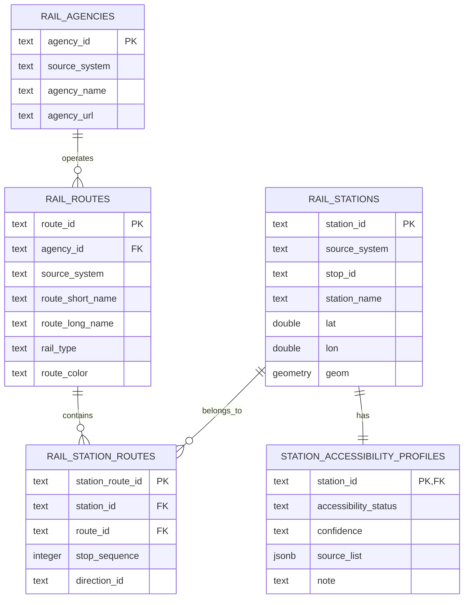
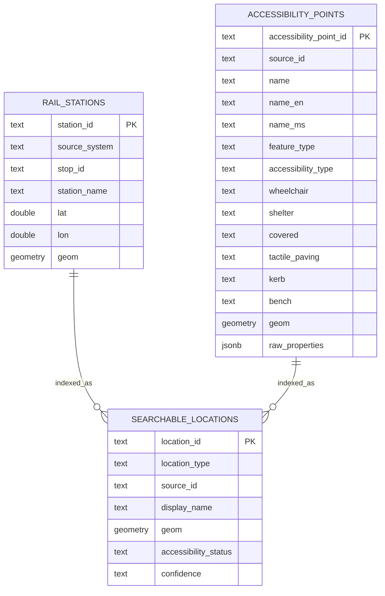
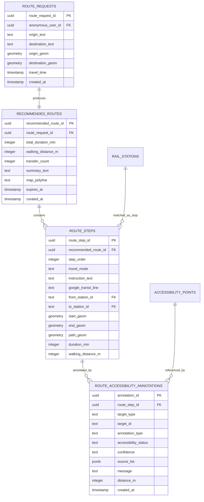
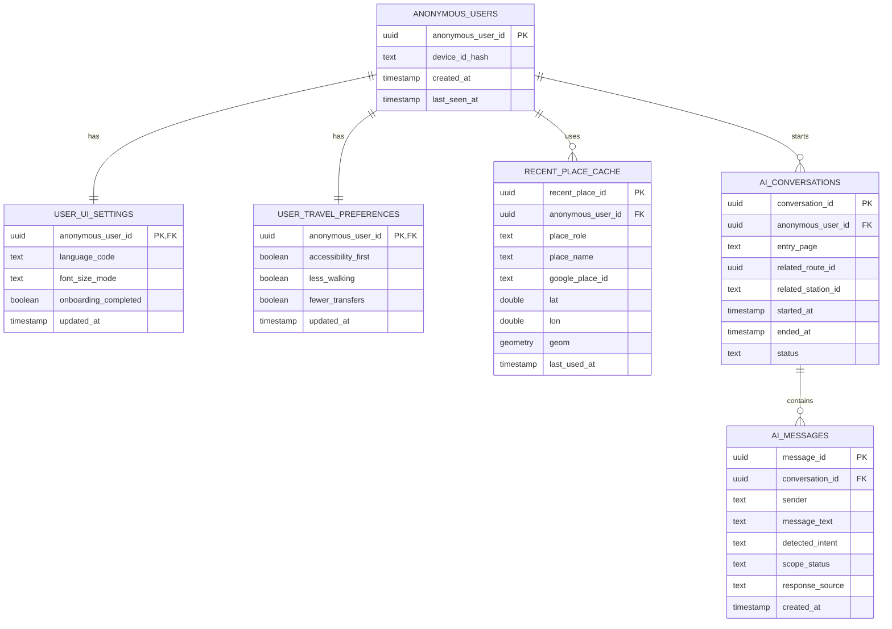
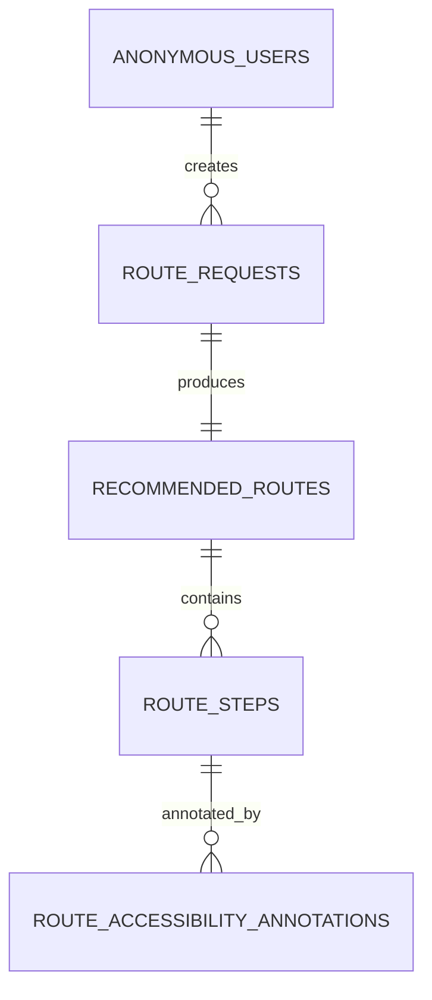

# ElderGo KL Current Data Plan

## 1. Scope

This data plan describes the current-stage data design for ElderGo KL. It covers:

- Business workflows
- Data objects
- Data relationships
- Data sources
- PostgreSQL/PostGIS database prototype
- Python ETL data ingestion workflow
- Interaction between the FastAPI backend, frontend, and database

The current-stage design follows these core principles:

- Route generation depends on the Google Maps API.
- The local database does not store all Google candidate routes. It stores only the final recommended route and its accessibility annotations.
- Bus routes do not use static GTFS data at this stage. Bus route information is provided by Google Maps.
- Rail data uses static GTFS CSV files from KTMB and Rapid Rail.
- Accessibility data is stored only as Point geometry. LineString accessibility features are not used at this stage.
- Accessibility information is not real-time status. It represents support recorded in static datasets.
- Missing accessibility data does not mean unsupported. It must be marked as `unknown`.

---

## 2. Business Workflows

### 2.1 Static Data Preparation Workflow

```text
KTMB GTFS CSV
+ Rapid Rail GTFS CSV
+ cleaned accessibility Point CSV
        -> Python ETL cleaning and standardisation
        -> PostgreSQL/PostGIS
        -> rail stations, rail routes, accessibility points,
           station accessibility profiles, and search index
```

### 2.2 Route Recommendation and Epic 5 Accessibility Annotation Workflow

```text
User enters origin, destination, and travel time
        -> Frontend calls FastAPI
        -> FastAPI stores route_request
        -> FastAPI calls Google Maps API
        -> Google returns candidate routes
        -> FastAPI selects the final recommended route based on user preferences
        -> FastAPI stores recommended_route and route_steps
        -> FastAPI generates accessibility annotations for each route_step
        -> Frontend displays route summary, steps, and accessibility hints
```

Epic 5 accessibility annotations are generated for two step types.

Transit step:

```text
Google transit step
        -> Check whether Google explicitly returns wheelchair/accessibility support
        -> If yes: mark supported, source=google_accessibility_hint
        -> If not: match local rail_stations by station name and coordinates
        -> Read station_accessibility_profiles
        -> If local support information exists: mark supported
        -> If no local information exists: mark unknown
```

Walking step:

```text
Google walking polyline
        -> PostGIS queries accessibility_points within 30m/50m
        -> shelter=yes or covered=yes
        -> nearby_sheltered_point
        -> wheelchair=yes / lift / accessible_entrance / kerb_ramp
        -> nearby_accessibility_support
        -> If no match exists
        -> unknown / no nearby static accessibility data
```

### 2.3 Epic 6 Station and Facility Search Workflow

```text
rail_stations
+ accessibility_points
        -> searchable_locations
        -> Frontend searches station / accessibility point
        -> FastAPI queries searchable_locations
        -> Return search results with basic accessibility status
```

`searchable_locations` is a search index table. It is not the single source of truth for business facts. If future features add indoor station maps, indoor facilities, or rush-hour prediction, those features should use independent business tables and then sync searchable summaries into `searchable_locations`.

### 2.4 User Cache Workflow

```text
User opens the system for the first time
        -> Frontend generates device_id
        -> FastAPI hashes device_id
        -> FastAPI creates or reads anonymous_users
        -> FastAPI reads user_ui_settings and user_travel_preferences
        -> Frontend restores language, font size, preferences, and onboarding status
```

---

## 3. Data Objects

Current-stage data objects are divided into two groups:

1. Business data objects
2. User cache data objects

### 3.1 Business Data Objects

| Data object | Table name | Purpose |
|---|---|---|
| Rail agency | `rail_agencies` | Stores operators and source systems such as KTMB and Rapid KL. |
| Rail route | `rail_routes` | Stores KTM, LRT, MRT, Monorail, and related rail route information. |
| Rail station | `rail_stations` | Stores rail station names, coordinates, and source information. |
| Station-route relationship | `rail_station_routes` | Stores which routes each station belongs to and station ordering. |
| Accessibility point | `accessibility_points` | Stores Point-type accessibility facilities. |
| Station accessibility profile | `station_accessibility_profiles` | Summarises accessibility status and confidence for each station. |
| Route request | `route_requests` | Stores one user origin-destination route request. |
| Final recommended route | `recommended_routes` | Stores the final route selected from Google candidate routes. |
| Route step | `route_steps` | Stores step-by-step information for the final recommended route. |
| Route accessibility annotation | `route_accessibility_annotations` | Stores accessibility hints displayed in Epic 5. |
| Search index | `searchable_locations` | Supports Epic 6 search for rail stations and accessibility points. |

### 3.2 User Cache Data Objects

| Data object | Table name | Purpose |
|---|---|---|
| Anonymous user | `anonymous_users` | Identifies the same device user without login. |
| UI settings | `user_ui_settings` | Caches language, font size, and onboarding state. |
| Travel preferences | `user_travel_preferences` | Caches accessibility-first, less-walking, and fewer-transfer preferences. |
| Recent place | `recent_place_cache` | Caches recent origins and destinations. |
| AI conversation | `ai_conversations` | Stores one future Epic 8 AI assistant conversation. |
| AI message | `ai_messages` | Stores messages between the user and AI assistant for future Epic 8. |

---

## 4. Data Relationships

### 4.1 Static Rail Business Data



### 4.2 Accessibility Points and Epic 6 Search Index



### 4.3 Route Results and Epic 5 Annotations



### 4.4 User Cache Relationships



### 4.5 Relationship Between Anonymous Users and Runtime Business Results

Static business tables do not directly link to users. Runtime route result tables are linked to anonymous users through `route_requests`.



---

## 5. Data Sources

### 5.1 GTFS Data Sources

| Source | File | Usage | Fields used |
|---|---|---|---|
| KTMB GTFS | `agency.csv` | Required | `agency_id`, `agency_name`, `agency_url`, `agency_timezone` |
| KTMB GTFS | `routes.csv` | Required | `route_id`, `agency_id`, `route_short_name`, `route_long_name`, `route_type`, `route_color` |
| KTMB GTFS | `stops.csv` | Required | `stop_id`, `stop_name`, `stop_lat`, `stop_lon` |
| KTMB GTFS | `trips.csv` | Reserved | `trip_id`, `route_id`, `service_id`, `direction_id` |
| KTMB GTFS | `stop_times.csv` | Reserved | `trip_id`, `stop_id`, `stop_sequence`, `arrival_time`, `departure_time` |
| Rapid Rail GTFS | `agency.csv` | Required | `agency_id`, `agency_name`, `agency_url`, `agency_timezone` |
| Rapid Rail GTFS | `routes.csv` | Required | `route_id`, `agency_id`, `route_short_name`, `route_long_name`, `route_type`, `route_color`, `category`, `status` |
| Rapid Rail GTFS | `stops.csv` | Required | `stop_id`, `stop_name`, `stop_lat`, `stop_lon`, `category`, `route_id`, `isOKU`, `status`, `search` |
| Rapid Rail GTFS | `trips.csv` | Reserved | `trip_id`, `route_id`, `service_id`, `trip_headsign`, `direction_id` |
| Rapid Rail GTFS | `stop_times.csv` | Reserved | `trip_id`, `stop_id`, `stop_sequence`, `arrival_time`, `departure_time` |

The current stage does not depend on:

- `calendar.csv`
- `shapes.csv`
- `frequencies.csv`

These files may be used as future enhancements, but they are not required for MVP business logic.

### 5.2 Accessibility Data Sources

| Source file | Field | Description |
|---|---|---|
| `accessibility_feature_clean.csv` | `source_id` | Original accessibility point source ID. |
| `accessibility_feature_clean.csv` | `name_en`, `name_ms`, `name_default` | Name fields, which may be empty. |
| `accessibility_feature_clean.csv` | `feature_type` | Feature type, such as `bus_stop`, `elevator`, or `station_entrance`. |
| `accessibility_feature_clean.csv` | `accessibility_type` | Accessibility meaning, such as `wheelchair_stop`, `lift`, or `kerb_ramp`. |
| `accessibility_feature_clean.csv` | `wheelchair` | Whether wheelchair-related support is recorded. |
| `accessibility_feature_clean.csv` | `shelter` | Whether shelter is recorded. |
| `accessibility_feature_clean.csv` | `covered` | Whether covered support is recorded. |
| `accessibility_feature_clean.csv` | `tactile_paving` | Tactile paving information. |
| `accessibility_feature_clean.csv` | `kerb` | Kerb type. |
| `accessibility_feature_clean.csv` | `bench` | Whether a bench is recorded. |
| `accessibility_feature_clean.csv` | `geom_type` | Only Point geometries are retained at this stage. |
| `accessibility_feature_clean.csv` | `geom_wkt` | Converted to PostGIS geometry. |
| `accessibility_feature_clean.csv` | `raw_properties` | Original properties for traceability. |

`accessibility_transit_points_clean.csv` can be used to validate transit-related points. In the simplified current model, it can be imported into `accessibility_points` and distinguished using `feature_type` and `accessibility_type`.

### 5.3 Google Maps API Data Source

At runtime, Google Maps API provides:

- Origin and destination place information
- Route candidate results
- Recommended route steps
- Departure stop and arrival stop for transit steps
- Polyline for walking steps
- Possible accessibility hints

The local database stores only the final selected recommended route. It does not store all candidate routes returned by Google.

---

## 6. Database Prototype and Field Definitions

### 6.1 `rail_agencies`

Stores rail data sources and operators.

| Field | Type | Description |
|---|---|---|
| `agency_id` | text PK | Operator primary key. A source prefix is recommended. |
| `source_system` | text | `ktmb` or `rapid_rail`. |
| `agency_name` | text | Operator name. |
| `agency_url` | text | Operator website. |
| `agency_timezone` | text | Time zone. |

### 6.2 `rail_routes`

Stores rail routes.

| Field | Type | Description |
|---|---|---|
| `route_id` | text PK | Route primary key. A source prefix is recommended. |
| `agency_id` | text FK | References `rail_agencies`. |
| `source_system` | text | Data source. |
| `route_short_name` | text | Short route name. |
| `route_long_name` | text | Long route name. |
| `rail_type` | text | `KTM`, `LRT`, `MRT`, `Monorail`, or `unknown`. |
| `route_color` | text | Route colour. |

### 6.3 `rail_stations`

Stores rail stations.

| Field | Type | Description |
|---|---|---|
| `station_id` | text PK | Station primary key. A source prefix is recommended. |
| `source_system` | text | `ktmb` or `rapid_rail`. |
| `stop_id` | text | Original GTFS stop ID. |
| `station_name` | text | Station name. |
| `lat` | double precision | Latitude. |
| `lon` | double precision | Longitude. |
| `geom` | geometry(Point, 4326) | PostGIS spatial point. |

Coordinate conversion rule:

```sql
ST_SetSRID(ST_MakePoint(lon, lat), 4326)
```

### 6.4 `rail_station_routes`

Stores the relationship between stations and routes.

| Field | Type | Description |
|---|---|---|
| `station_route_id` | text PK | Relationship primary key. |
| `station_id` | text FK | References `rail_stations`. |
| `route_id` | text FK | References `rail_routes`. |
| `stop_sequence` | integer | Station order within the route. |
| `direction_id` | text | Direction. |

This table is derived from `trips.csv` and `stop_times.csv`.

### 6.5 `accessibility_points`

Stores Point-type accessibility facilities.

| Field | Type | Description |
|---|---|---|
| `accessibility_point_id` | text PK | Accessibility point primary key. |
| `source_id` | text | Original source ID. |
| `name` | text | Display name, using name fields first and then type fallback. |
| `name_en` | text | English name. |
| `name_ms` | text | Malay name. |
| `feature_type` | text | What the point is. |
| `accessibility_type` | text | Accessibility meaning of the point. |
| `wheelchair` | text | `yes`, `no`, `limited`, or empty. |
| `shelter` | text | `yes`, `no`, or empty. |
| `covered` | text | `yes`, `no`, or empty. |
| `tactile_paving` | text | Tactile paving information. |
| `kerb` | text | Kerb type. |
| `bench` | text | Whether a bench exists. |
| `geom` | geometry(Point, 4326) | Spatial point. |
| `raw_properties` | jsonb | Original properties. |

Example `feature_type` values:

- `bus_stop`
- `station`
- `platform`
- `elevator`
- `station_entrance`
- `kerb_ramp`
- `accessible_entrance`

Example `accessibility_type` values:

- `wheelchair_stop`
- `lift`
- `accessible_station_entrance`
- `kerb_ramp`
- `wheelchair_access`
- `tactile_path`

### 6.6 `station_accessibility_profiles`

Stores the summary accessibility status for each station.

| Field | Type | Description |
|---|---|---|
| `station_id` | text PK/FK | References `rail_stations`. |
| `accessibility_status` | text | `supported`, `unknown`, or `not_supported`. |
| `confidence` | text | `high`, `medium`, or `low`. |
| `source_list` | jsonb | Sources used for the conclusion. |
| `note` | text | Explanation. |

Current-stage generation rules:

```text
Rapid Rail isOKU=true
-> supported / high / ["rapid_rail_isOKU"]

wheelchair=yes accessibility point within 50m
-> supported / medium / ["accessibility_point_50m"]

No explicit data
-> unknown / low / []
```

The `not_supported` value is reserved. It should not be actively generated at this stage unless future reliable official data explicitly states that support is unavailable.

### 6.7 `route_requests`

Stores one user route request.

| Field | Type | Description |
|---|---|---|
| `route_request_id` | uuid PK | Route request primary key. |
| `anonymous_user_id` | uuid FK | References anonymous user. Nullable. |
| `origin_text` | text | Origin text. |
| `destination_text` | text | Destination text. |
| `origin_geom` | geometry(Point, 4326) | Origin coordinate. |
| `destination_geom` | geometry(Point, 4326) | Destination coordinate. |
| `travel_time` | timestamp | User-selected travel time. |
| `created_at` | timestamp | Creation time. |

### 6.8 `recommended_routes`

Stores the final recommended route.

| Field | Type | Description |
|---|---|---|
| `recommended_route_id` | uuid PK | Recommended route primary key. |
| `route_request_id` | uuid FK | References `route_requests`. |
| `total_duration_min` | integer | Total duration. |
| `walking_distance_m` | integer | Total walking distance. |
| `transfer_count` | integer | Number of transfers. |
| `summary_text` | text | Route summary. |
| `map_polyline` | text | Google polyline. |
| `expires_at` | timestamp | Cache expiry time. |
| `created_at` | timestamp | Creation time. |

### 6.9 `route_steps`

Stores the steps of a recommended route.

| Field | Type | Description |
|---|---|---|
| `route_step_id` | uuid PK | Route step primary key. |
| `recommended_route_id` | uuid FK | References the recommended route. |
| `step_order` | integer | Step order. |
| `travel_mode` | text | `WALKING`, `TRANSIT`, etc. |
| `instruction_text` | text | Step instruction. |
| `google_transit_line` | text | Transit line name returned by Google. |
| `from_station_id` | text FK | Matched local origin station. |
| `to_station_id` | text FK | Matched local destination station. |
| `start_geom` | geometry(Point, 4326) | Step start point. |
| `end_geom` | geometry(Point, 4326) | Step end point. |
| `path_geom` | geometry(LineString, 4326) | Walking or route segment geometry. |
| `duration_min` | integer | Step duration. |
| `walking_distance_m` | integer | Walking distance. |

### 6.10 `route_accessibility_annotations`

Stores route accessibility annotations displayed in Epic 5.

| Field | Type | Description |
|---|---|---|
| `annotation_id` | uuid PK | Annotation primary key. |
| `route_step_id` | uuid FK | References `route_steps`. |
| `target_type` | text | `station`, `accessibility_point`, or `google_hint`. |
| `target_id` | text | Target object ID. |
| `annotation_type` | text | Annotation type. |
| `accessibility_status` | text | `supported`, `unknown`, or `not_supported`. |
| `confidence` | text | `high`, `medium`, or `low`. |
| `source_list` | jsonb | Data sources. |
| `message` | text | Frontend display message. |
| `distance_m` | integer | Distance, used for nearby points. |
| `created_at` | timestamp | Creation time. |

Example `annotation_type` values:

- `station_wheelchair_accessibility`
- `nearby_sheltered_point`
- `nearby_accessibility_support`
- `accessibility_unknown`

### 6.11 `searchable_locations`

Stores the Epic 6 search entry table.

| Field | Type | Description |
|---|---|---|
| `location_id` | text PK | Search object ID. |
| `location_type` | text | `rail_station`, `bus_stop`, `elevator`, `kerb_ramp`, etc. |
| `source_id` | text | Original source ID. |
| `display_name` | text | Search result display name. |
| `geom` | geometry(Geometry, 4326) | Spatial location. |
| `accessibility_status` | text | Accessibility status shown in search summary. |
| `confidence` | text | Search summary confidence. |

### 6.12 User Cache Tables

#### `anonymous_users`

| Field | Type | Description |
|---|---|---|
| `anonymous_user_id` | uuid PK | Anonymous user ID. |
| `device_id_hash` | text | Hashed device ID. |
| `created_at` | timestamp | First creation time. |
| `last_seen_at` | timestamp | Last usage time. |

#### `user_ui_settings`

| Field | Type | Description |
|---|---|---|
| `anonymous_user_id` | uuid PK/FK | Anonymous user ID. |
| `language_code` | text | `en` or `ms`. |
| `font_size_mode` | text | `standard`, `large`, or `extra_large`. |
| `onboarding_completed` | boolean | Whether onboarding is completed. |
| `updated_at` | timestamp | Update time. |

#### `user_travel_preferences`

| Field | Type | Description |
|---|---|---|
| `anonymous_user_id` | uuid PK/FK | Anonymous user ID. |
| `accessibility_first` | boolean | Whether accessibility is prioritised. |
| `less_walking` | boolean | Whether less walking is preferred. |
| `fewer_transfers` | boolean | Whether fewer transfers are preferred. |
| `updated_at` | timestamp | Update time. |

#### `recent_place_cache`

| Field | Type | Description |
|---|---|---|
| `recent_place_id` | uuid PK | Recent place ID. |
| `anonymous_user_id` | uuid FK | Anonymous user ID. |
| `place_role` | text | `origin` or `destination`. |
| `place_name` | text | Place name. |
| `google_place_id` | text | Google Place ID. |
| `lat` | double precision | Latitude. |
| `lon` | double precision | Longitude. |
| `geom` | geometry(Point, 4326) | Spatial point. |
| `last_used_at` | timestamp | Last usage time. |

#### `ai_conversations`

| Field | Type | Description |
|---|---|---|
| `conversation_id` | uuid PK | AI conversation ID. |
| `anonymous_user_id` | uuid FK | Anonymous user ID. |
| `entry_page` | text | Page where the user opened AI. |
| `related_route_id` | uuid | Optional related recommended route. |
| `related_station_id` | text | Optional related station. |
| `started_at` | timestamp | Conversation start time. |
| `ended_at` | timestamp | Conversation end time. |
| `status` | text | `active`, `closed`, or `failed`. |

#### `ai_messages`

| Field | Type | Description |
|---|---|---|
| `message_id` | uuid PK | Message ID. |
| `conversation_id` | uuid FK | References AI conversation. |
| `sender` | text | `user`, `assistant`, or `system`. |
| `message_text` | text | Message content. |
| `detected_intent` | text | Detected intent. |
| `scope_status` | text | `supported`, `out_of_scope`, `unclear`, or `missing_data`. |
| `response_source` | text | `database`, `google`, `static_help`, `mixed`, or `fallback`. |
| `created_at` | timestamp | Creation time. |

---

## 7. PostgreSQL Data Ingestion Plan

### 7.1 Database Initialisation

PostgreSQL should enable:

```sql
CREATE EXTENSION IF NOT EXISTS postgis;
CREATE EXTENSION IF NOT EXISTS pg_trgm;
CREATE EXTENSION IF NOT EXISTS "uuid-ossp";
```

### 7.2 Python ETL Steps

Python ETL imports CSV data into PostgreSQL.

```text
Step 1: Read KTMB / Rapid Rail agency.csv
        -> rail_agencies

Step 2: Read routes.csv
        -> rail_routes

Step 3: Read stops.csv
        -> rail_stations

Step 4: Read trips.csv + stop_times.csv
        -> rail_station_routes

Step 5: Read accessibility_feature_clean.csv
        -> accessibility_points

Step 6: Use PostGIS for 50m spatial matching between stations and accessibility points
        -> station_accessibility_profiles

Step 7: Sync rail_stations and accessibility_points into searchable_locations
```

### 7.3 Key ETL Transformation Rules

ID prefixes:

```text
ktmb:50500
rapid_rail:KJ15
osm:node/1707840846
```

Coordinate conversion:

```sql
ST_SetSRID(ST_MakePoint(lon, lat), 4326)
```

Accessibility Point restriction:

```text
Import only geom_type = Point
Skip LineString
```

Accessibility name fallback:

```text
name_en
-> name_ms
-> name_default
-> accessibility_type display label
-> source_id
```

KTMB data quality handling:

```text
If stop_times references a missing stop_id, skip the invalid row.
Do not create fake stations that do not exist in stops.csv.
```

### 7.4 Recommended Indexes

Spatial indexes:

```sql
CREATE INDEX ON rail_stations USING GIST (geom);
CREATE INDEX ON accessibility_points USING GIST (geom);
CREATE INDEX ON route_steps USING GIST (path_geom);
CREATE INDEX ON searchable_locations USING GIST (geom);
```

Search indexes:

```sql
CREATE INDEX ON rail_stations USING GIN (station_name gin_trgm_ops);
CREATE INDEX ON searchable_locations USING GIN (display_name gin_trgm_ops);
```

---

## 8. Frontend, Backend, and Database Interaction

### 8.1 System Structure

```text
Frontend
        -> REST API
FastAPI Backend
        -> SQL / ORM
PostgreSQL + PostGIS
        -> Static rail data + accessibility data + route result data
```

The frontend does not connect directly to PostgreSQL. All database access goes through FastAPI.

### 8.2 First Entry and User Cache

Frontend:

```text
Read or generate local device_id
Call POST /users/resolve
```

FastAPI:

```text
Hash device_id
Query anonymous_users
Create anonymous_users if it does not exist
Create default user_ui_settings
Create default user_travel_preferences
Return user settings
```

Database tables involved:

- `anonymous_users`
- `user_ui_settings`
- `user_travel_preferences`

### 8.3 Updating Language, Font Size, and Preferences

Frontend:

```text
PUT /users/{anonymous_user_id}/ui-settings
PUT /users/{anonymous_user_id}/travel-preferences
```

FastAPI:

```text
Validate language_code / font_size_mode
Update user_ui_settings
Update user_travel_preferences
```

Database tables involved:

- `user_ui_settings`
- `user_travel_preferences`

### 8.4 Epic 6 Station and Facility Search

Frontend:

```text
GET /locations/search?q=KL Sentral
GET /locations/{location_id}
```

FastAPI:

```text
Query searchable_locations
If location_type = rail_station:
    Query rail_stations and station_accessibility_profiles
If location_type = accessibility_point:
    Query accessibility_points
Return unified search result
```

Database tables involved:

- `searchable_locations`
- `rail_stations`
- `station_accessibility_profiles`
- `accessibility_points`

### 8.5 Epic 5 Route Planning

Frontend:

```text
POST /routes/recommend
```

Request body:

```json
{
  "anonymous_user_id": "...",
  "origin_text": "Taman Bahagia",
  "destination_text": "KL Sentral",
  "origin_lat": 3.1100,
  "origin_lon": 101.6000,
  "destination_lat": 3.1340,
  "destination_lon": 101.6869,
  "travel_time": "2026-04-26T09:00:00"
}
```

FastAPI:

```text
1. Read user_travel_preferences
2. Insert route_requests
3. Call Google Maps API
4. Select final recommended route based on preferences
5. Insert recommended_routes
6. Parse Google steps and insert route_steps
7. Generate station annotations for transit steps
8. Generate nearby accessibility point annotations for walking steps
9. Return recommended_route + route_steps + annotations
```

Database tables involved:

- `user_travel_preferences`
- `route_requests`
- `recommended_routes`
- `route_steps`
- `route_accessibility_annotations`
- `rail_stations`
- `station_accessibility_profiles`
- `accessibility_points`

### 8.6 Epic 5 Transit Step Annotation Logic

For each transit step, FastAPI performs:

```text
1. Check whether Google explicitly returns accessibility support.
2. If yes:
   - annotation status = supported
   - confidence = medium
   - source_list = ["google_accessibility_hint"]
3. If Google does not return accessibility support:
   - Match rail_stations by Google station name and coordinates
   - Read station_accessibility_profiles
4. If the local profile is supported:
   - annotation status = supported
   - confidence = profile.confidence
5. If local data is also missing:
   - annotation status = unknown
   - confidence = low
```

### 8.7 Epic 5 Walking Step Annotation Logic

For each walking step, FastAPI performs:

```text
1. Convert Google walking polyline into PostGIS LineString.
2. Query accessibility_points within 30m/50m.
3. If shelter=yes or covered=yes:
   - annotation_type = nearby_sheltered_point
4. If wheelchair=yes or accessibility_type is lift / accessible_entrance / kerb_ramp:
   - annotation_type = nearby_accessibility_support
5. If no match exists:
   - Generate an unknown annotation or let the frontend hide this hint type.
```

Query example:

```sql
SELECT *
FROM accessibility_points
WHERE ST_DWithin(
    geom::geography,
    :walking_path_geom::geography,
    50
);
```

### 8.8 Future Epic 8 AI Assistant Interaction

Frontend:

```text
POST /ai/conversations
POST /ai/conversations/{conversation_id}/messages
```

FastAPI:

```text
Create ai_conversations
Store user message in ai_messages
Detect intent and scope_status
Query business tables or static help content
Store assistant reply in ai_messages
```

Database tables involved:

- `ai_conversations`
- `ai_messages`
- Optional reads from `recommended_routes`, `rail_stations`, and `station_accessibility_profiles`

---

## 9. Current-Stage Design Conclusion

At the current stage, the database is not a complete transport scheduling system. It is a static enhancement database built around Google route results.

Core value:

```text
Google Maps is responsible for route generation.
PostgreSQL/PostGIS stores rail stations, accessibility points, and route results.
FastAPI combines Google routes with local static data.
Epic 5 displays route accessibility hints through route_accessibility_annotations.
Epic 6 supports expandable station and facility search through searchable_locations.
```

The current-stage design contains approximately 11 business tables and 6 user cache tables. Static business tables and user tables remain relatively independent. Runtime route results are linked to anonymous users through `route_requests.anonymous_user_id`.
