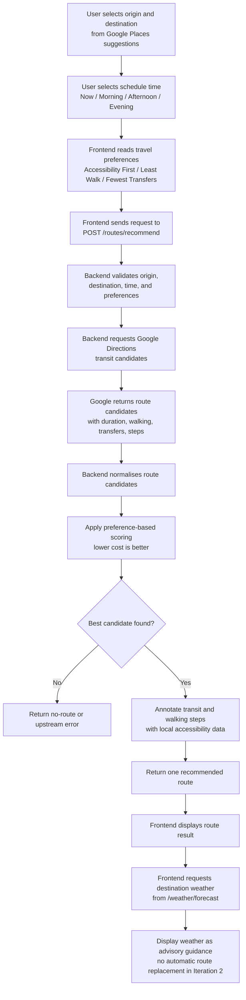

# Insert for System Architecture and Technical Design Specification v2.0

## Where to Paste

Paste this section in **Section 5: Core Business Workflows**, immediately after **5.2 Backend Route Processing Flow** and before the station/weather flows.

Recommended heading:

**5.3 Route Recommendation Decision Logic: Preferences, Schedule Time, and Weather Advice**

If the current document already has Section 5.3 as Weather Advice or Environment Data Flow, renumber the later subsections accordingly:

- Existing 5.3 Weather Advice Flow becomes 5.4
- Existing 5.4 Preference and UI Settings Flow becomes 5.5

---

## 5.3 Route Recommendation Decision Logic: Preferences, Schedule Time, and Weather Advice

This workflow explains how ElderGo KL combines user route inputs, selected schedule time, and travel preferences to generate one senior-friendly route recommendation. The current Iteration 2 implementation separates **route recommendation factors** from **post-recommendation advisory factors** so the system remains transparent and testable.

The route recommendation process begins when the user selects a valid origin and destination from Google Places suggestions and then chooses a travel time option. The frontend sends the selected places, selected departure time, anonymous user ID when available, and the three travel preferences to the backend `/routes/recommend` endpoint.

The three supported travel preferences are:

- **Accessibility First**: prioritises route candidates with lower walking burden and fewer transfers because these are currently the most reliable measurable proxies for elderly-friendly travel.
- **Least Walk**: gives stronger priority to routes with shorter walking distance.
- **Fewest Transfers**: gives stronger priority to routes with fewer transit changes.

The selected schedule time affects the route search by being passed into the Google Directions request. In the current implementation, the `now` option is sent directly as `departure_time=now`, allowing Google Directions to calculate candidate routes based on current transit availability. Other time labels are captured by the frontend flow and kept in the route request model, but deeper scheduled departure handling can be expanded in a later iteration.

After Google Directions returns candidate transit routes, ElderGo KL normalises each candidate into comparable values such as total duration, total walking distance, transfer count, route steps, and route polyline. The backend then calculates a route cost using the user preferences. Lower route cost is better. When a preference is enabled, that preference has stronger influence on the ordering:

- If **Accessibility First** is enabled, candidates with less walking and fewer transfers are considered first.
- If **Least Walk** is enabled, walking distance becomes a stronger decision factor.
- If **Fewest Transfers** is enabled, transfer count becomes a stronger decision factor.
- Duration remains part of the weighted cost so the system avoids selecting an unreasonable route only because it has fewer transfers or less walking.

The backend returns one recommended route rather than a list of alternatives. This design reduces decision burden for older adults and presents a single route with step-by-step guidance, accessibility annotations, weather advice, save options, and sharing options.

Weather is currently handled as **advisory information after route recommendation**, not as an automatic route replacement factor. Once the recommended route is available, the frontend requests weather advice for the route destination and selected travel time context. The Route Result page displays senior-friendly weather guidance, such as reminders about rain, heat, or preparation, but it does not automatically recalculate or replace the recommended route in Iteration 2.

This distinction is important for system reliability. Preferences and schedule time participate in the route recommendation flow, while weather currently helps the user make an informed decision after the recommendation is shown. A future iteration can extend this design by introducing weather-aware scoring, for example by increasing walking penalties during heavy rain or high heat, but this behaviour is not part of the current dev-branch implementation.

### Figure 4: Route Recommendation Decision Logic

### Current Iteration 2 Behaviour Summary

| Factor | Current Role in Iteration 2 | Notes |
|---|---|---|
| Origin and destination | Required route inputs | Must be selected from Google Places suggestions before continuing. |
| Schedule time | Participates in route request | `now` is passed into Google Directions as current departure time. Other labels are captured for the planning flow and future expansion. |
| Accessibility First | Affects route scoring | Prioritises lower walking distance and fewer transfers as practical accessibility proxies. |
| Least Walk | Affects route scoring | Increases the penalty for walking distance. |
| Fewest Transfers | Affects route scoring | Increases the penalty for route transfers. |
| Weather | Advisory after recommendation | Displayed on Route Result page; does not automatically change the recommended route in the current branch. |
| Accessibility annotations | Added after candidate selection | Google hints and local PostgreSQL/PostGIS station/accessibility data are used to explain route steps. |

### Future Enhancement: Weather-Aware Scoring

If Iteration 3 introduces weather-aware route scoring, the current design can be extended without changing the main route-planning user flow. The backend can request weather before final route selection and adjust the route cost when weather increases risk for older adults.

Possible future scoring rules:

- Increase walking-distance penalty during heavy rain.
- Increase walking-distance penalty during high heat.
- Prefer fewer transfers during poor weather to reduce outdoor waiting.
- Show a stronger warning when no lower-risk route is available.

This should be presented as a future enhancement unless the backend route scoring service is updated to use weather data before selecting the recommended route.
